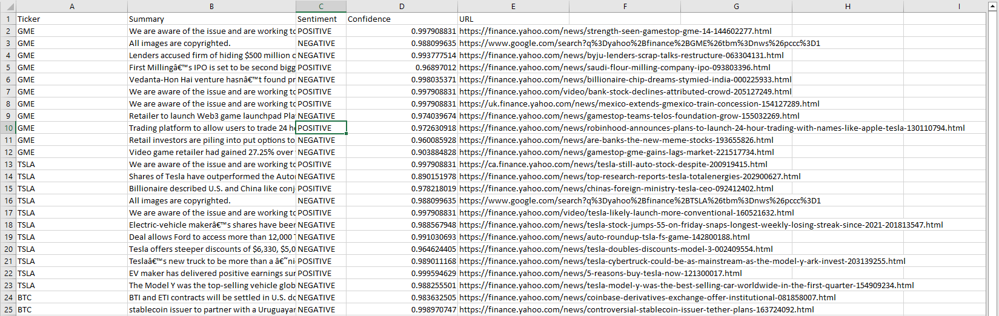

# Financial_News_Summarization_Sentiment_Analysis

## Overview of the project

1. Scrape Stock and Crypto news from the Google news using BeautifulSoup. 
2. Summarize each article using fine tuned Hugging Face Transformers model. 
3. Find Sentiment using Tranformers Pipeline and export as CSV


## Installation

In order to use the Cell Image Analyzer on your local machine, it is necessary to have Python 3.6 or a newer version installed. Subsequently, you can install the necessary packages by executing the following command:

```bash
pip install -r requirements.txt
```

This will install all the necessary dependencies


## Usage
To start the streamlit app, simply run the following command:
### To run the application
``` 
run notebook.ipynb (or)

python scrapesummarizesentiment.py
```

### Final Output saved as CSV



### Note:
You can add as many tickers as you want to get the summaries, sentiment, scores in the final CSV file